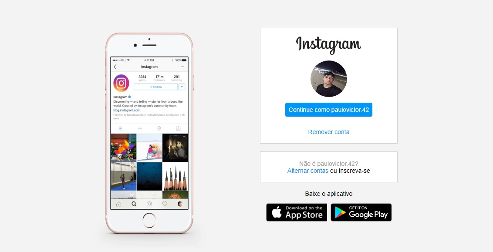

# Projeto Instagram desenvolvido pelo bootcamp da Digital Innnovation One

Neste projeto, o desafio foi reconstruir a página inicial do Instagram, no qual foi abordado o conceito de CSS utilizando Flexbx, uma metodologia de 
posicionamento em elementos de tela mais utilizada no mercado assim como coceitos de responsividade.
